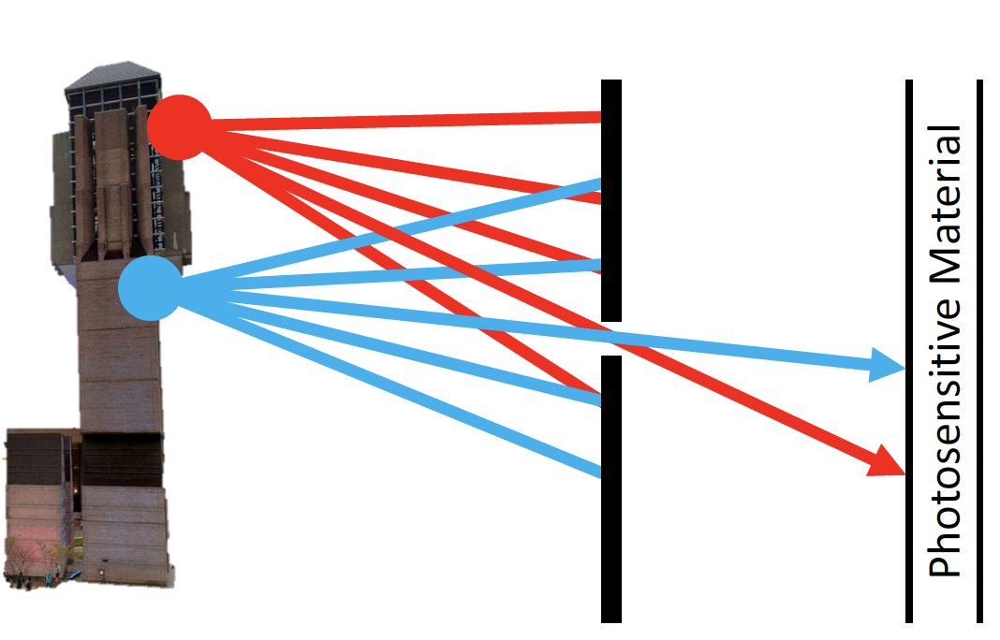
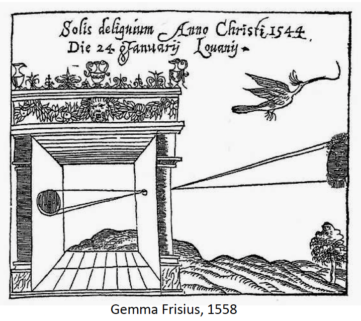
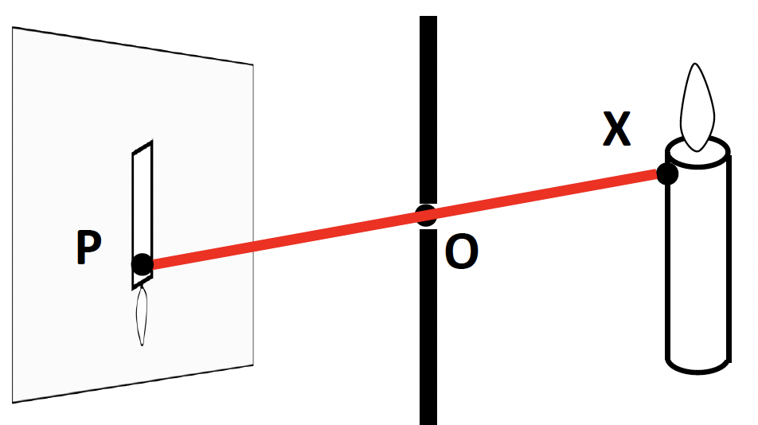
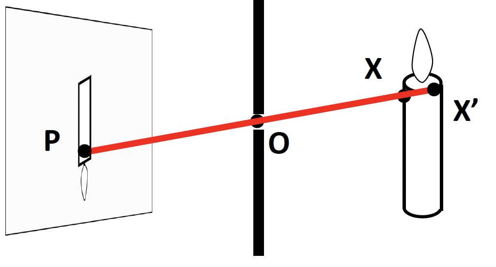
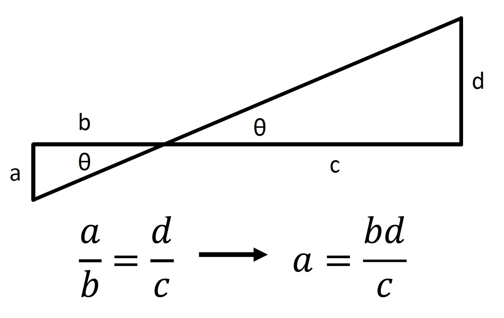
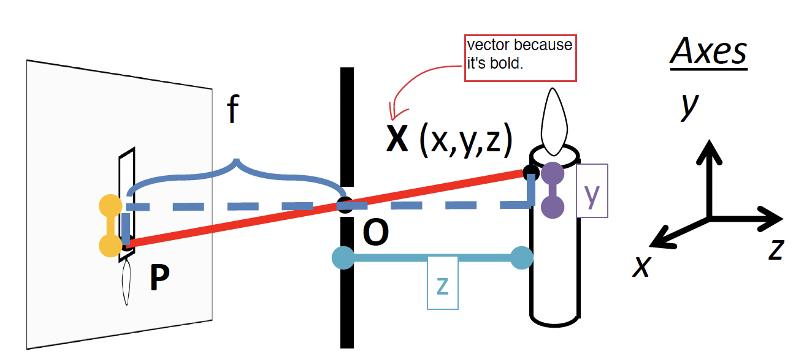
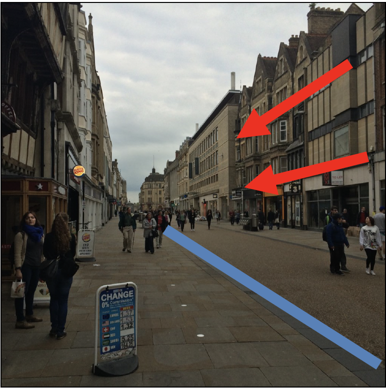

# Lecture 1 Intro and Cameras (1-4-23)

With a camera we need some sort of barrier to help deter all the light that comes through. The reason behind this, think about if we had film for a camera and we exposed the whole roll, then we would not have an image as the "rays" of light would hit all spots of the film equally giving us a blank image.

Now if we put up a barrier, some of the light will be able to pass, and now it will give us an image.

## Camera Obscura

This is when we have a hole in a wall, and this hole "connects" the dark room to the outside, and this image is upside down and projected in the dark room.

## Projection

For this following example we have a candle and we want to project it to this "canvas." How do we find the projection $P$ of a point $X$? 

Well, we can form a visual ray from $X$ to the camera center $O$, and intersect it with the camera plane (the canvas).

Another example, we will ask ourselves will both $X$ and $X'$ project to $P$? Which appears in the image? Are there points for which projection is undefined?

<!-- CHECK THIS!!! -->
The answer is that they both project to $P$, but only $X$ appears in the image. The point (singular) for which the projection is undefined is the origin. We can think of the $z$-axis being 0 (where the origin is defined), and this would only give us one point.

## Projection Equations

We can use law of similar triangles to help us find projections. 

Let's look at the next example. We can set up our own coordinate system, so let's call the origin $O$, $XY$ in image, $Z$ sticks out. XY is the image plane, and $Z$ is the optical axis.

We can say $(x,y,z)$ projects to $(\frac{f_x}{z}, \frac{f_y}{z})$ via similar triangles!

## Some Facts About Projection

* 3D lines project to 2D lines.
* The projection of any 3D parallel lines converge to a vanishing point.
* Distant objects are smaller.

The blue line represents the 3D lines projecting to 2D lines, and the red arrows are the projection of 3D parallel lines converging to the vanishing point.

## What's Lost?

There are somethings to consider when we are using projection. Let's look at the last example. With one of the people, are they close or far away? We cannot answer that. 

We have to be careful when we are drawing conclusions with projections. 

* Projections of a 3D line is a 2D line, but 2D line is NOT a 3D line. A counter example would be turning a hanger to the side, we would still get a 2D line, and not a 3D line.
* Projections of parallel 3D lines converge at a vanishing point; NOT any pair of lines that converge are parallel in 3D.

